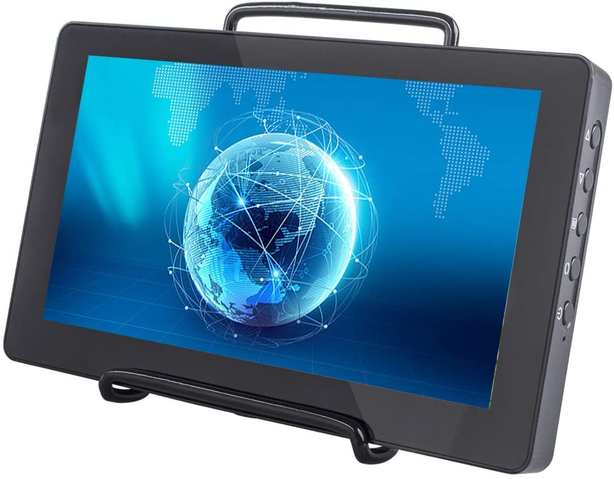

.. note::

    Hello, welcome to the SunFounder Raspberry Pi & Arduino & ESP32 Enthusiasts Community on Facebook! Dive deeper into Raspberry Pi, Arduino, and ESP32 with fellow enthusiasts.

    **Why Join?**

    - **Expert Support**: Solve post-sale issues and technical challenges with help from our community and team.
    - **Learn & Share**: Exchange tips and tutorials to enhance your skills.
    - **Exclusive Previews**: Get early access to new product announcements and sneak peeks.
    - **Special Discounts**: Enjoy exclusive discounts on our newest products.
    - **Festive Promotions and Giveaways**: Take part in giveaways and holiday promotions.

    👉 Ready to explore and create with us? Click [|link_sf_facebook|] and join today!

|link_TS7C_7inch_Touch_Screen|
==================================

* |link_7inch_Touch_Screen|

**Dear Customwers:**

Thanks for purchasing SunFounder 7 inch Touchsceen. It uses a premium integrated 
circuit, which has the advantages of low power consumption, stable performance, 
no radiation, etc. It is small, easy to use, and secure. The display applies to computer, Raspberry Pi devices, portable display and so on. It is suitable for the Raspberry 
Pi 3 model B/B+ and 4 Model B, and has the 1024×600 physical resolution. The resolution is adjustable within the range 640×480~1920×1200. Ideal for applications like retro gaming, industrial control, as a secondary monitor, in home automation, for 3D printing control, and as a |link_pc_monitor|.

Please read this instruction carefully for reliable and long-term use and the best audio-visual effects.

**Note:**

1) Please use the proper power adapter included in the package. Pay attention to 
   using other qualified power supplies if needed.
   
2) Do not expose the device to sunlight, neither deposit or use it at too cold, too 
   hot or humid place.
   
3) Avoid bright light exposure when you use it to ensure good image effect and 
   long-term use of the device.
   
4) Although shock protection and precautions have been designed inside the 
   device, you should avoid violent collisions.
   
5) For the screen equipped with touch display, please avoid excessive force on it 
   when you touch in case of potential damages on the touch screen surface.
   
6) Do not use chemical reagent or solvent to clean the device. Please use a piece 
   of soft cloth to wipe the dust on the device so it can display the beautiful 
   colors as it always does.
   
7) No adjustable components for users in the device. For nonprofessionals, do not 
   try to open or repair this product by yourself in case of unwanted damages.

If you have any questions, please send an email to **service@sunfounder.com** and we’ll reply as soon as possible.

**About the display language**

In addition to English, we are working on other languages for this course. Please contact service@sunfounder.com if you are interested in helping, and we will give you a free product in return. 
In the meantime, we recommend using Google Translate to convert English to the language you want to see.

The steps are as follows.

* In this course page, right-click and select **Translate to xx**. If the current language is not what you want, you can change it later.

.. image:: img/translate1.png
    :align: center

* There will be a language popup in the upper right corner. Click on the menu button to **choose another language**.

.. image:: img/translate2.png
    :align: center

* Select the language from the inverted triangle box, and then click **Done**.

.. image:: img/translate3.png
    :align: center

.. toctree::
    :maxdepth: 2

    packing_list
    install_the_rpi_os
    quick_guide
    button_&_port
    fixed
    on_screen_settings
    settings_for_raspberry_pi
    product_features
    faq
	
Copyright Notice
--------------------------

All contents including but not limited to texts, images, and code in this manual are owned by the SunFounder Company. You should only use it for personal study,investigation, enjoyment, or other non-commercial or nonprofit purposes, under therelated regulations and copyrights laws, without infringing the legal rights of the author and relevant right holders. For any individual or organization that uses these for commercial profit without permission, the Company reserves the right to take legal action.
