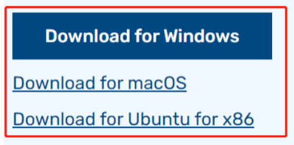
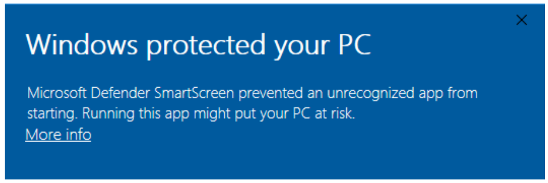
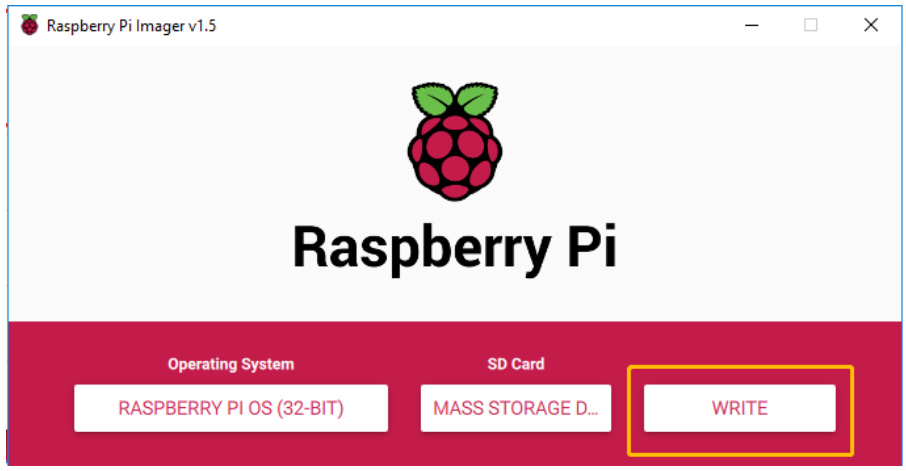
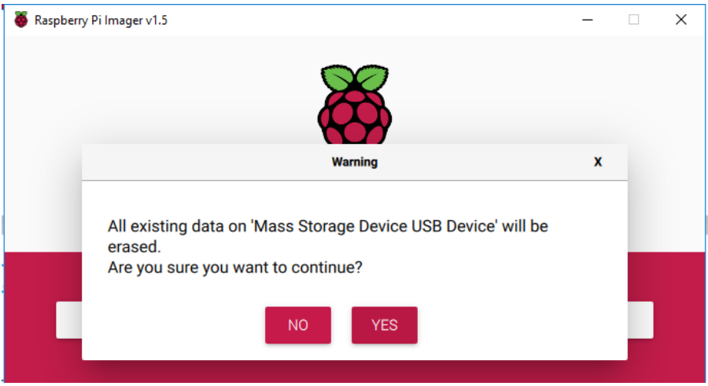
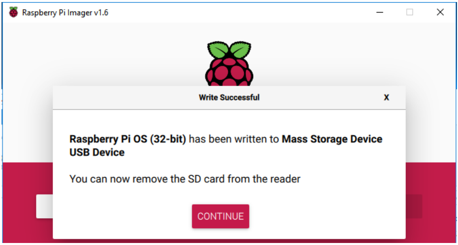

Install the Raspberry Pi OS
=============================

In this chapter, we firstly learn to write the Raspberry Pi OS to your Micro SD card. 
You can check the complete tutorial on the official website of the Raspberry Pi: 
https://projects.raspberrypi.org/en/projects/raspberry-pi-setting-up.

.. note::
    If you have already done it, you can skip this chapter.

**Required Components**

+-------------------------+--------------------------+
|1 * Micro SD Card        |1 * Personal Computer     |
+-------------------------+--------------------------+
|1 * Micro SD Card Reader |                          |
+-------------------------+--------------------------+

**Step 1**

Raspberry Pi have developed a graphical SD card writing tool that works on Mac 
OS, Ubuntu 18.04 and Windows, and is the easiest option for most users as it will 
download the image and install it automatically to the SD card.

Visit the download page: https://www.raspberrypi.org/software/. Click on the 
link for the Raspberry Pi Imager that matches your operating system, when the 
download finishes, click it to launch the installer.

**Step 2**

When you launch the installer, your operating system may try to block you from 
running it. For example, on Windows I receive the following message:

If this pops up, click on **More info** and then **Run anyway**, then follow the 
instructions to install the Raspberry Pi Imager.

**Step 3**

Insert your SD card into the computer or laptop SD card slot.

**Step 4**

In the Raspberry Pi Imager, click **CHOOSE OS** -> **Raspberry Pi OS(Legacy)**.

    .. warning::

      * Please do not install the **Bookworm** version to avoid the **double-click** function and the **virtual keyboard** not working.
      * You need to install the **Raspberry Pi OS (Legacy)** version - **Debian Bullseye**.
      * Additionally, for a perfect touch experience, it is recommended to install the **Ubuntu** system.

    .. image:: img/image24.png
        :align: center

**Step 5**

Select the SD card you are using.

.. image:: img/image25.png

**Step 6**

To open the advanced options page, click the **setting** button (appears after selecting operating system) or press **Ctrl+Shift+X**. Now, set hostname, enable ssh and set the username and password.

    .. warning::

        Make sure to note down the ``hostname``, ``username``, and ``password``; they're crucial for later remote access to the Raspberry Pi.

    .. image:: img/image26.png
        :align: center

Then scroll down to complete the wifi configuration and click **SAVE**.

    .. note::

        **wifi country** should be set the two-letter `ISO/IEC alpha2 code <https://en.wikipedia.org/wiki/ISO_3166-1_alpha-2#Officially_assigned_code_elements>`_ for the country in which you are using your Raspberry Pi, please refer to the following link: https://en.wikipedia.org/wiki/ISO_3166-1_alpha-2#Officially_assigned_code_elements

    .. image:: img/image27.png
        :align: center

**Step 7**

Click the WRITE button.

**Step 8**

If your SD card currently has any files on it, you may wish to back up these files first 
to prevent you from permanently losing them. If there is no file to be backed up, 
click **Yes**.

**Step 9**

After waiting for a period of time, the following window will appear to represent the 
completion of writing.

