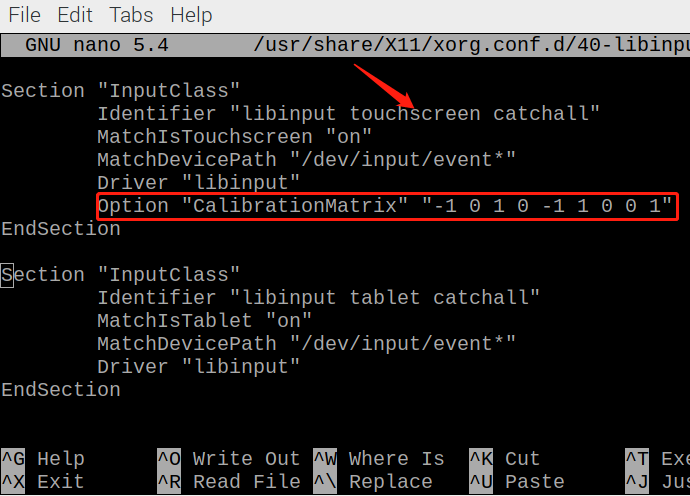

Settings for Raspberry Pi
===========================

Adjust the Resolution
-----------------------

For the Raspberry Pi 3 and the lower versions, you need reset the resolution ratio as  follows. As for Raspberry Pi 4, when you start up it, the resolution is optimum. If you want to change its resolution, please refer to the next part.  

**For Raspberry Pi 3 or Lower Version**

**Step 1: Open config.txt.**

.. code::

	sudo nano /boot/config.txt
	
**Step 2: Modify the /boot/config.txt file.**

1) Define a custom CVT mode (since Raspberry Pi uses the standard rate when 1024x600 is not included, you need to set the aspect ratio close to 16:9) and add the following lines below #hdmi_force_hotplug=1.

.. code::

	hdmi_cvt=1024 600 60 3 0 0 0

hdmi_cvt=<width> <height> <framerate> <aspect> <margins> <interlace>

+-----------+------------+------------------------------------------------------------+
| value     | Default    | Description                                                |
+-----------+------------+------------------------------------------------------------+
| width     | (required) | width in pixels                                            |
+-----------+------------+------------------------------------------------------------+
| height    | (required) | height in pixels                                           |
+-----------+------------+------------------------------------------------------------+
| framerate | (required) | framerate in Hz                                            |
+-----------+------------+------------------------------------------------------------+
| aspect    | 3          | aspect ratio 1=4:3, 2=14:9, 3=16:9, 4=5:4, 5=16:10, 6=15:9 |
+-----------+------------+------------------------------------------------------------+
| margins   | 0          | 0=margins disabled, 1=margins enabled                      |
+-----------+------------+------------------------------------------------------------+
| interlace | 0          | 0=progressive, 1=interlaced                                |
+-----------+------------+------------------------------------------------------------+
| rb        | 0          | 0=normal, 1=reduced blanking                               |
+-----------+------------+------------------------------------------------------------+

	
2) Find the following lines, delete the "#" mark and modify the value like this:

.. code::

	hdmi_group=2
	hdmi_mode=87
	....
	hdmi_drive=2
	
**hdmi_group=2** means DMT (Display Monitor Timings, the standard typically used on monitors)
**hdmi_mode=87** indicates we create a new hdmi mode named 87. 
**hdmi_drive=2** selects the Normal HDMI mode. 

After the modification is done, save and exit. For more details about configuring config.txt, refer to Raspberry Pi official website: 
https://www.raspberrypi.org/documentation/configuration/config-txt.md. 

**Step 3: Reboot Raspberry Pi.**

Reboot the Raspberry pi with the command sudo reboot. 

.. code::

	sudo reboot
	
**For Raspberry Pi 4**

1) Click the **Raspberry Pi icon** -> **Preferences** -> **Screen Configuration**.

.. image:: img/image11.png

2) Then choose **Configure** -> **Screens** -> **HDMI-1** -> **Resolution** -> **choose the resolution that you want**.

.. image:: img/image12.png

3) After that you need to click the **tick icon** to save your configure.

.. image:: img/image13.png

Install Virtual Keyboard on Raspberry Pi
-------------------------------------------

When you use a touch panel, you can connect an external keyboard to help you do a text input operation, but it is best to install a virtual keyboard.

Install the required software with the following command.

.. code-block:: shell

  sudo apt install onboard
  sudo apt install at-spi2-core

In order to make the virtual keyboard have a better effect, you need to do further settings.

Click the Raspberry Pi icon in the upper left corner and select **Preferences** -> **Onboard Settings**.

.. image:: img/onboard.png

In the **General** option, check the following 2 items. When you check **Automatically display when editing text**, you will be prompted to reboot, you can reboot after all settings are complete.

.. image:: img/keyboard1.png

In the **Window** option, check **Dock to screen edge**.

.. image:: img/keyboard2.png

And in **Auto-show** option, check **Auto-show when editing text** again.

.. image:: img/keyboard3.png

The next 2 items are optional, the ones checked in the picture are recommended by us, you can also check other ones.

In **Layout** option, **Small** is recommanded.

.. image:: img/keyboard4.png

In **Theme** option, **DarkRoom** is recommanded.

.. image:: img/keyboard5.png

After the setting is complete, restart Raspberry pi. Every time you restart Raspberry pi, you need to click **General Access** -> **Onboard** to enable the virtual keyboard.

.. image:: img/enable_onboard.png

Now you can use this keyboard to edit your files or codes.

.. image:: img/keyboard6.png

Right Click on Raspberry Pi
---------------------------

The touchscreen makes it easy to perform simple navigation tasks with your finger or stylus, but you may want to be able to use the context menu (right-click menu).

Then you will need to download a ``Touchégg``. Enter the following command to install it.

**For 32-bit OS:**

.. raw:: html

    <run></run>

.. code-block:: shell

    wget https://github.com/JoseExposito/touchegg/releases/download/2.0.14/touchegg_2.0.14_armhf.deb
    sudo apt install ./touchegg_2.0.14_armhf.deb

**For 64-bit OS:**

.. raw:: html 

    <run></run>

.. code-block:: shell

    wget https://github.com/JoseExposito/touchegg/releases/download/2.0.14/touchegg_2.0.14_arm64.deb
    sudo apt install ./touchegg_2.0.14_arm64.deb

After restarting, you can double-tap the screen to bring up the context menu.

.. raw:: html

    <run></run>

.. code-block:: shell

    sudo reboot

.. image:: img/right_click.png
  :align: center

.. note::
    The product is not compatible with some of `Touchégg's <https://github.com/JoseExposito/touchegg>`_ gestures, such as three-finger zoom in/out.

Rotate the Display and Touch Angle
----------------------------------

After the Raspberry Pi is turned on, if you find that the display or touch angle is not correct, or you need to rotate to other angles during use, you can follow the tutorial below to achieve them.

Rotate the Display Angle
^^^^^^^^^^^^^^^^^^^^^^^^

There are two ways to rotate the display angle, one way is from the Raspberry Pi desktop, and the other way is using the command line.

**1. Set from the Raspberry Pi Desktop**

Click the **Raspberry Pi icon** -> **Preferences** -> **Screen Configuration**.

    .. image:: img/TSimage11.png

Then click **Configure** -> **Screens** -> **HDMI-1** -> **Orientation**, then select the angle you want to rotate.

    .. image:: img/orientation.png

Click the green checkbox to take effect.

    .. image:: img/check.png

.. note::

    * After checking the box, you need to confirm the changes by clicking **OK** within 10 seconds, otherwise it will go back to the previous angle.

    .. image:: img/invert_ok.png

    * For Debian Bullseye system, there is only one option - **Inverted**, if you want to rotate to another angle, you need to set it from command line.

**2. Using the Command Line**

To make this change stay after a reboot, do the following to rotate your display.

Open the ``autostart`` file.

.. raw:: html

    <run></run>

.. code-block:: shell

    sudo nano /etc/xdg/lxsession/LXDE-pi/autostart

Add the following line to the end.

.. code-block::
    
    @xrandr --output HDMI-1 --rotate right

* ``right`` represents the direction of rotation, and there are 4 directions to choose from: ``normal``, ``right``, ``left`` and ``inverted``.

After restarting the Raspberry Pi, you will see the effect of rotation.

.. raw:: html

    <run></run>

.. code-block:: shell
    
    sudo reboot

Rotate Touch Angle 
^^^^^^^^^^^^^^^^^^^

Run the following command to open the ``40-libinput.conf`` file.

.. raw:: html

    <run></run>

.. code-block:: shell

    sudo nano /usr/share/X11/xorg.conf.d/40-libinput.conf

Find the touchscreen section and add the corresponding rotation angle to it.

* 0 degrees: ``Option "CalibrationMatrix" "1 0 0 0 1 0 0 0 1"``
* 90 degrees: ``Option "CalibrationMatrix" "0 1 0 -1 0 1 0 0 1"``
* 180 degrees: ``Option "CalibrationMatrix" "-1 0 1 0 -1 1 0 0 1"``
* 270 degrees: ``Option "CalibrationMatrix" "0 -1 1 1 0 0 0 0 1"``

.. note::
    For some Raspberry Pis, you may set the rotation angle of touch to 90°, but eventually you find that it is not 90° and you need to manually alternate these 4 sets of values.

After restarting the Raspberry Pi, you will see the effect of rotation.

.. raw:: html

    <run></run>

.. code-block:: shell
    
    sudo reboot