Settings for Raspberry Pi
===========================

Adjust the Resolution
-----------------------

For the Raspberry Pi 3 and the lower versions, you need reset the resolution ratio as  follows. As for Raspberry Pi 4, when you start up it, the resolution is optimum. If you want to change its resolution, please refer to the next part.  

**For Raspberry Pi 3 or Lower Version**

**Step 1: Open config.txt.**

.. code::

	sudo nano /boot/config.txt
	
**Step 2: Modify the /boot/config.txt file.**

1) Define a custom CVT mode (since Raspberry Pi uses the standard rate when 1024x600 is not included, you need to set the aspect ratio close to 16:9) and add the following lines below #hdmi_force_hotplug=1.

.. code::

	hdmi_cvt=1024 600 60 3 0 0 0

hdmi_cvt=<width> <height> <framerate> <aspect> <margins> <interlace>

+-----------+------------+------------------------------------------------------------+
| value     | Default    | Description                                                |
+-----------+------------+------------------------------------------------------------+
| width     | (required) | width in pixels                                            |
+-----------+------------+------------------------------------------------------------+
| height    | (required) | height in pixels                                           |
+-----------+------------+------------------------------------------------------------+
| framerate | (required) | framerate in Hz                                            |
+-----------+------------+------------------------------------------------------------+
| aspect    | 3          | aspect ratio 1=4:3, 2=14:9, 3=16:9, 4=5:4, 5=16:10, 6=15:9 |
+-----------+------------+------------------------------------------------------------+
| margins   | 0          | 0=margins disabled, 1=margins enabled                      |
+-----------+------------+------------------------------------------------------------+
| interlace | 0          | 0=progressive, 1=interlaced                                |
+-----------+------------+------------------------------------------------------------+
| rb        | 0          | 0=normal, 1=reduced blanking                               |
+-----------+------------+------------------------------------------------------------+

	
2) Find the following lines, delete the "#" mark and modify the value like this:

.. code::

	hdmi_group=2
	hdmi_mode=87
	....
	hdmi_drive=2
	
**hdmi_group=2** means DMT (Display Monitor Timings, the standard typically used on monitors)
**hdmi_mode=87** indicates we create a new hdmi mode named 87. 
**hdmi_drive=2** selects the Normal HDMI mode. 

After the modification is done, save and exit. For more details about configuring config.txt, refer to Raspberry Pi official website: 
https://www.raspberrypi.org/documentation/configuration/config-txt.md. 

**Step 3: Reboot Raspberry Pi.**

Reboot the Raspberry pi with the command sudo reboot. 

.. code::

	sudo reboot
	
**For Raspberry Pi 4**

1) Click the **Raspberry Pi icon** -> **Preferences** -> **Screen Configuration**.

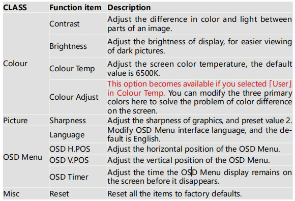

2) Then choose **Configure** -> **Screens** -> **HDMI-1** -> **Resolution** -> **choose the resolution that you want**.

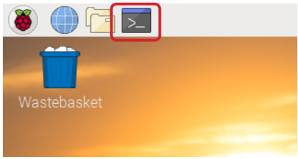

3) After that you need to click the **tick icon** to save your configure.

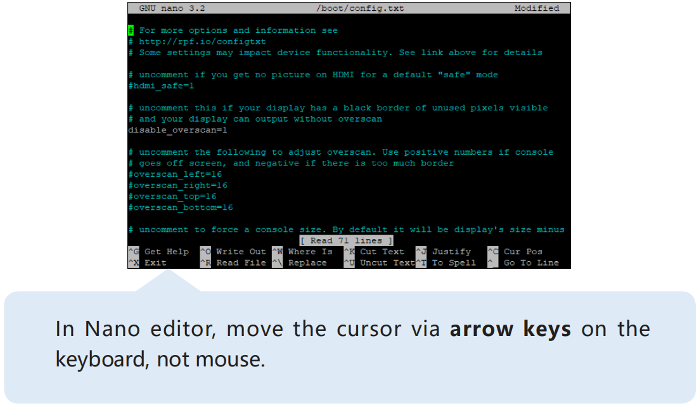

Install Virtual Keyboard on Raspberry Pi
-------------------------------------------

When you use a touch panel, you can connect an external keyboard to help you do a text input operation, but it is best to install a virtual keyboard.

Install the required software with the following command.

.. code-block:: shell

  sudo apt install onboard
  sudo apt install at-spi2-core

In order to make the virtual keyboard have a better effect, you need to do further settings.

Click the Raspberry Pi icon in the upper left corner and select **Preferences** -> **Onboard Settings**.

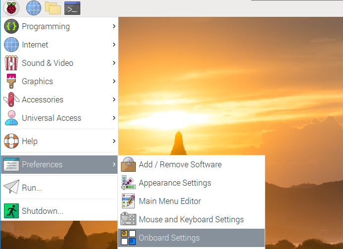

In the **General** option, check the following 2 items. When you check **Automatically display when editing text**, you will be prompted to reboot, you can reboot after all settings are complete.

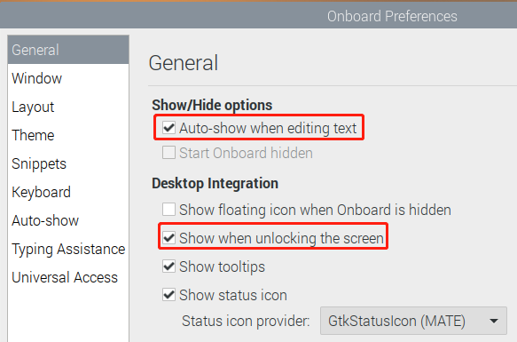

In the **Window** option, check **Dock to screen edge**.

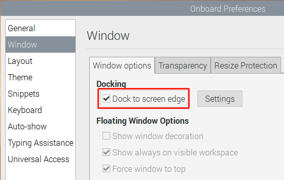

And in **Auto-show** option, check **Auto-show when editing text** again.

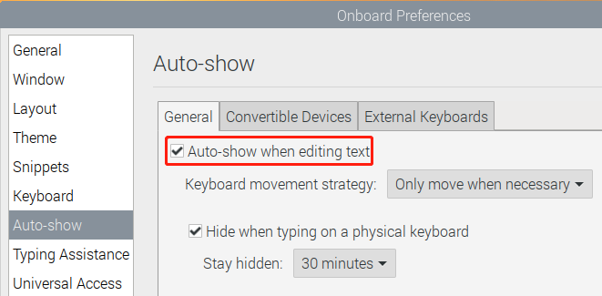

The next 2 items are optional, the ones checked in the picture are recommended by us, you can also check other ones.

In **Layout** option, **Small** is recommanded.

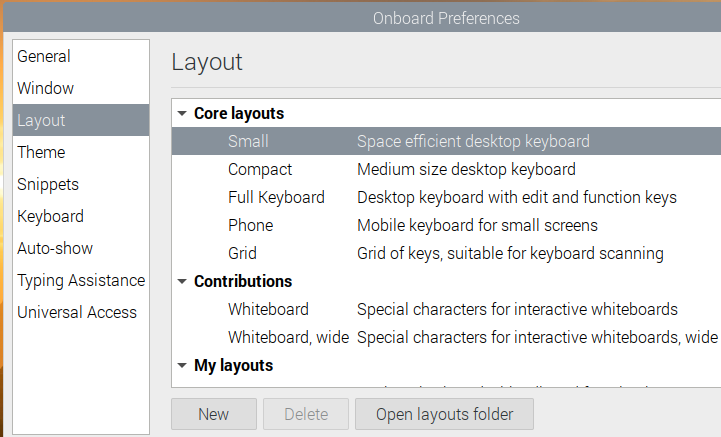

In **Theme** option, **DarkRoom** is recommanded.

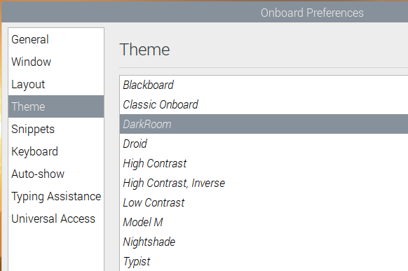

After the setting is complete, restart Raspberry pi. Every time you restart Raspberry pi, you need to click **General Access** -> **Onboard** to enable the virtual keyboard.

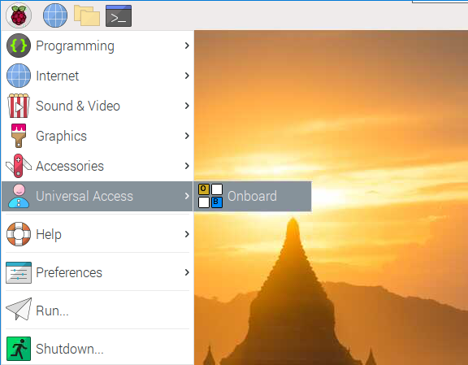

Now you can use this keyboard to edit your files or codes.

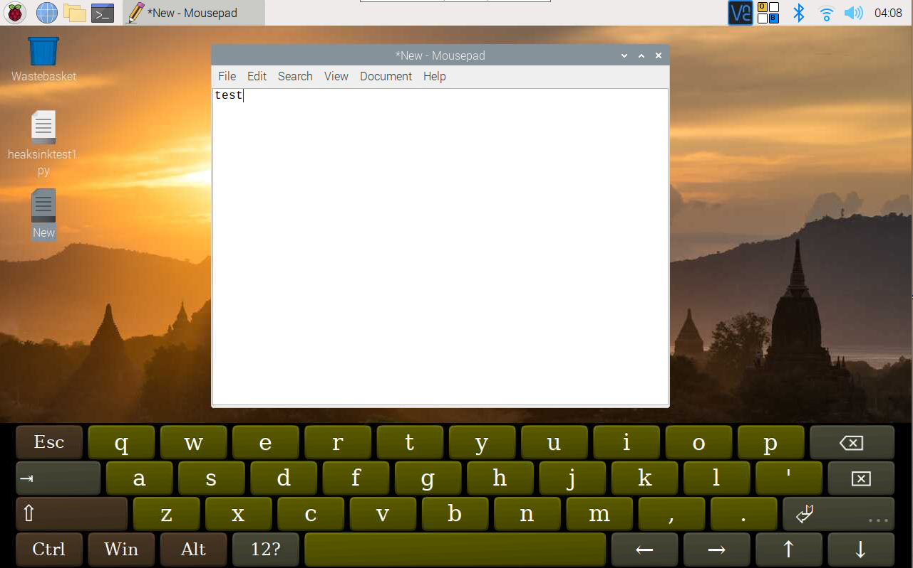

Right Click on Raspberry Pi
------------------------------

Touchscreen tablets and displays make it easy for you to perform simple navigation tasks with your fingers or stylus, but at some point, you may want to use right-click commands to quickly access context-specific shortcuts.

Here we use ``evdev-rce`` to make right-click command still available.

Enter the following command to install the required software.

  .. code-block:: shell

    sudo apt install build-essential libevdev2 libevdev-dev
    git clone 'https://github.com/PeterCxy/evdev-right-click-emulation.git'
    cd 'evdev-right-click-emulation'

Enter the following command to build.

  .. code-block:: shell

    make all

Copy the file to the ``/usr`` directory.

  .. code-block:: shell

    sudo cp 'out/evdev-rce' '/usr/local/bin/'

Make it executable.

  .. code-block:: shell

    sudo chmod +x '/usr/local/bin/evdev-rce'

Modify the /etc/rc.local file to enable boot-up.

  .. code-block:: shell

    sudo nano /etc/rc.local

After entering rc.local, add the following command before ``exit 0``.

.. code-block:: shell

  sudo /usr/local/bin/evdev-rce &

After restarting, you can long press on the desktop and see if the right click function appears.

.. code-block:: shell

  sudo reboot

.. image:: img/right_click.png
  :align: center
